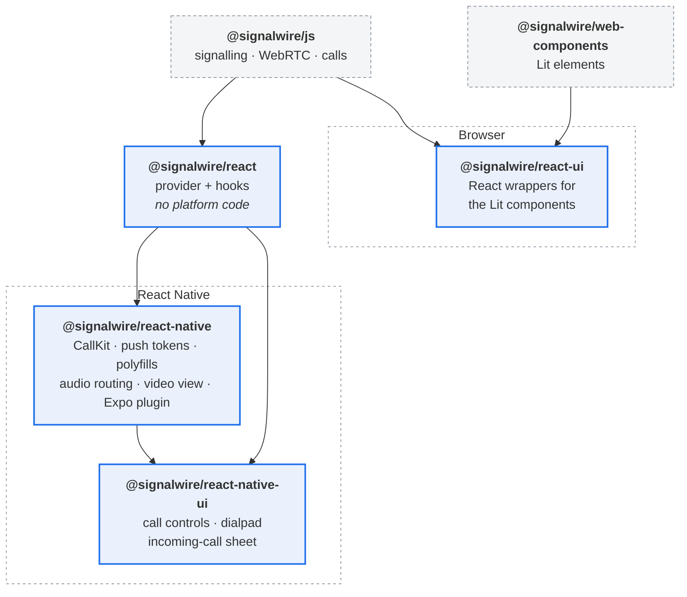
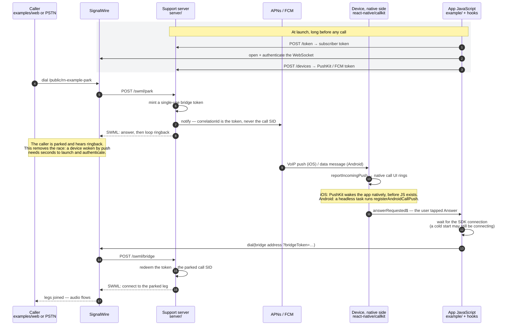

# `@signalwire/react-native`

> **Unofficial.** This is a community project, not a SignalWire product, and is
> not affiliated with or endorsed by SignalWire.

React Native support for [`@signalwire/js`](https://www.npmjs.com/package/@signalwire/js) v4.
Supplies the platform adapters the browser-oriented SDK needs on mobile, an
idiomatic React API over its RxJS observables, and native call UI through
CallKit and ConnectionService.

Supports iOS 13+ and Android 8+, on React Native 0.76+ (bare or Expo).

## What is verified

Tested on hardware and an emulator, not just in unit tests.

| | iOS | Android |
| --- | --- | --- |
| Outbound calls, with audio | ✅ iPad, iPadOS 17 | ✅ emulator, Android 16 |
| Inbound push → native call UI | ✅ PushKit + CallKit | ✅ FCM + ConnectionService |
| Answer from a **running** app | ✅ | ✅ |
| Answer from a **killed** app | ✅ | ✅ (release build — see note) |
| Two-way audio on a bridged call | ✅ | ✅ |
| Hang-up propagation, both directions | ✅ | ✅ |

Android cold start needs a **release** build to be tested meaningfully: the
Expo dev client starts a second JS runtime for the activity, so the entry
created by the headless push task is not in the context that draws the UI. One
`Android call push registered` line means one runtime; two means you are
testing the dev client, not your app.

**Known gaps**

- **Android has no lock-screen call UI.** `backToForeground()` only works on an
  unlocked device; a locked phone needs a full-screen-intent notification,
  which this package does not yet implement.
- **A voice call forces speakerphone.** The audio session mode is chosen from
  the app's `supportsVideo` capability rather than the call's own media, so a
  voice call in a video-capable app starts in video mode.

## Packages

| Install this | If you are building | Contains |
| --- | --- | --- |
| [`@signalwire/react`](packages/react) | A **browser** app | Provider and hooks. No platform code. |
| [`@signalwire/react-native`](packages/react-native) | A **React Native** app | The above, re-exported, plus adapters, video view, CallKit and audio routing. |
| [`@signalwire/react-ui`](packages/react-ui) | A **browser** app wanting ready-made UI | React wrappers for the SDK's Lit components. Optional. |
| [`@signalwire/react-native-ui`](packages/react-native-ui) | An **RN** app wanting ready-made UI | Native call controls, dialpad, participants, device picker, incoming-call sheet. Optional. |

The hooks are identical on both. React Native apps install one package and get
everything; browser apps install the core and skip the native weight entirely.



Arrows point from a package to what is built on top of it. Solid boxes are
published from this repository; dashed ones are peer dependencies you install
alongside.

Two things the diagram is meant to make obvious. `@signalwire/react` holds
every hook and knows nothing about a platform — that is what lets the same
`useCall` drive a browser tab and an iPad. And `@signalwire/react-ui` does
**not** sit on `@signalwire/react`: it wraps the SDK's Lit components directly,
so the two UI packages are siblings by name only and share no code.

### Entry points

| Import | For |
| --- | --- |
| `@signalwire/react-native` | Provider, hooks, video view |
| `@signalwire/react-native/polyfills` | **Must be line 1** of your entry file |
| `@signalwire/react-native/callkit` | Native call UI, push tokens, `registerAndroidCallPush` |
| `@signalwire/react-native/audio` | Speaker / earpiece / Bluetooth routing |
| `@signalwire/react-native/ringing` | `useRingingPushes`, for drawing your own incoming-call UI |

`./ringing` is deliberately separate from `./callkit`: the latter imports
`react-native-callkeep`, which constructs a `NativeEventEmitter` at import
time. A component library that only wants to *draw* ringing calls should not be
forced to install native call UI.

## Repository layout

| Path | What it is |
| --- | --- |
| [`packages/react/`](packages/react) | Universal core — provider and hooks |
| [`packages/react-ui/`](packages/react-ui) | React wrappers for the SDK's web components |
| [`packages/react-native/`](packages/react-native) | React Native platform layer |
| [`packages/react-native-ui/`](packages/react-native-ui) | React Native call UI components |
| [`example/`](example) | Expo dev-client demo app |
| [`examples/web/`](examples/web) | Vite browser demo — proves the core is universal |
| [`server/`](server) | Support server — device-token registry and APNs VoIP / FCM sender |
| [`docs/`](docs) | Native setup, push setup, device-test checklist |
| [`TESTING.md`](TESTING.md) | How to verify all of it, from a cold start |

## How a call flows

An **outbound** call is short, and involves no server at all once the app has a
token: `dial()` goes to SignalWire over the already-open WebSocket, and media
flows. Everything below is the **inbound** path, which is where the parts
divide up — and where every hard bug in this repository has been.



Who owns what:

| Role | Lives in | Notes |
| --- | --- | --- |
| Placing and receiving calls, media | `@signalwire/js` via `@signalwire/react` | Platform-agnostic; the hooks are the whole API |
| Native call UI, push tokens, ringing | `@signalwire/react-native/callkit` | CallKit on iOS, ConnectionService on Android |
| Waking a killed app | The OS, via PushKit / FCM | On iOS this happens **before any JavaScript exists** |
| Deciding who to ring, sending the push | `server/` — a scaffold, reimplement it | SignalWire has no push infrastructure; this is the missing middle |
| Parking the caller and bridging | `server/` SWML routes | `/swml/park` and `/swml/bridge` |
| Answering into a bridge dial | The **app**, not the package — `example/src/useBridgeAnswer.ts` | Deliberately app-level: the bridge address and token policy are yours |

Three consequences worth reading off the diagram:

- **The device dials out to answer.** It never receives an invite. The caller
  is parked and the woken device joins them, which is why an inbound call needs
  a publicly reachable server and an outbound one does not.
- **The push carries a token, not the call SID.** A payload containing the SID
  would be a capability anyone replaying it could spend. The server resolves
  the single-use token instead — which is also why answering twice fails
  cleanly.
- **Three processes must agree, and each fails silently.** The push can land
  while the app has no bundler, the funnel can be down so SignalWire never
  reaches `/swml/park`, or the SDK can still be connecting when the user hits
  Answer. All three look identical on the device: the call never arrives. See
  [`docs/device-testing.md`](docs/device-testing.md) for bringing the whole
  chain up and proving each link.

## Install

```bash
npm install @signalwire/react-native @signalwire/js rxjs \
  react-native-webrtc \
  @react-native-async-storage/async-storage \
  react-native-get-random-values \
  react-native-url-polyfill
```

Optional, each unlocking one feature:

| Package | Unlocks |
| --- | --- |
| `react-native-callkeep` | `@signalwire/react-native/callkit` — native call UI |
| `react-native-incall-manager` | `@signalwire/react-native/audio` — speaker/earpiece/Bluetooth routing |
| `@react-native-community/netinfo` | Network-loss detection and SDK reconnection |

Importing a subpath without its peer throws `MissingPeerDependencyError`, which
names the package and the install command.

## The import-order rule

**`@signalwire/react-native/polyfills` must be the first import in your entry
file, before anything that loads `@signalwire/js`.**

```js
// index.js
import '@signalwire/react-native/polyfills';

import { registerRootComponent } from 'expo';

import App from './App';

registerRootComponent(App);
```

Four things break without it:

- The SDK bundles `uuid`, which reads `crypto.getRandomValues`. Hermes has none.
- The SDK parses dial destinations with `new URL('destination:' + address)`.
  React Native's built-in `URL` silently drops a non-HTTP scheme, so every
  `dial()` targets the wrong address.
- The SDK's entry point dispatches a `CustomEvent` on `window` at import time,
  guarded only by `typeof window !== 'undefined'`. React Native satisfies that
  guard but provides neither `CustomEvent` nor `window.dispatchEvent`, so
  importing `@signalwire/js` throws.
- The SDK calls ES2025 iterator helpers (`Iterator.prototype.map`/`.find`) on
  Map iterators. Hermes does not implement them, so touching the directory
  throws `values().map is not a function`. This one is lazy rather than
  import-time, which makes it easy to miss in a quick smoke test.

`createReactNativePlatform()` verifies the polyfills ran and throws
`PolyfillNotInstalledError` naming the fix if they did not.

## Two build-config requirements — Expo SDK 52 only

**On Expo SDK 53 and newer, neither of these is needed.** The example app runs
on SDK 54 with a stock `babel.config.js` and no package-exports flag. They are
kept documented because the package still supports `react-native >=0.76.0`,
which includes SDK 52.

Both are consumer-side and neither is specific to Expo. You do **not** need to
change `moduleResolution` — the package ships `typesVersions`, so subpath types
resolve on Expo's stock `tsconfig.base` as well as on modern resolution.

**Metro must resolve package exports** for the `/polyfills`, `/callkit` and
`/audio` subpaths. On by default from Expo SDK 53; opt in before that:

```js
// metro.config.js
config.resolver.unstable_enablePackageExports = true;
```

**Babel must transform ES2022 static class blocks.** `@signalwire/js` ships
them in its ESM build, and `babel-preset-expo` did not handle them before
SDK 53:

```bash
npm install -D @babel/plugin-transform-class-static-block
```

```js
// babel.config.js
plugins: ['@babel/plugin-transform-class-static-block'];
```

## Quick start

New to this? [**docs/tutorial.md**](docs/tutorial.md) walks from
`create-expo-app` to a ringing phone, with a checkpoint at each stage. The
snippet below is the 30-second version.


```tsx
import {
  SignalWireProvider,
  SignalWireVideoView,
  useCall,
  useSignalWire
} from '@signalwire/react-native';
import { useMemo, useState } from 'react';
import { Button, View } from 'react-native';

import type { Call, CredentialProvider } from '@signalwire/js';

function Dialer() {
  const { isConnected, dial } = useSignalWire();
  const [call, setCall] = useState<Call | null>(null);
  const { status, hangup } = useCall(call);

  if (call) {
    return (
      <View style={{ flex: 1 }}>
        <SignalWireVideoView call={call} kind="remote" style={{ flex: 1 }} />
        <Button title={`End (${status})`} onPress={() => void hangup()} />
      </View>
    );
  }

  return (
    <Button
      title="Call"
      disabled={!isConnected}
      onPress={() => void dial('/public/my-room', { audio: true, video: true }).then(setCall)}
    />
  );
}

export default function App() {
  // Memoize: a new identity tears down the client and rebuilds it.
  const credentials = useMemo<CredentialProvider>(
    () => ({ authenticate: async () => ({ token: 'YOUR_SUBSCRIBER_TOKEN' }) }),
    []
  );

  return (
    <SignalWireProvider credentialProvider={credentials}>
      <Dialer />
    </SignalWireProvider>
  );
}
```

## Hooks

| Hook | Returns | Entry point |
| --- | --- | --- |
| `useSignalWire()` | `client`, `isConnected`, `isRegistered`, `user`, `directory`, `error`, `dial`, `disconnect` | `@signalwire/react-native` |
| `useCall(call)` | `status`, `participants`, `self`, `localStream`, `remoteStream`, `isAudioMuted`, `isVideoMuted`, `error`, `hangup`, `toggleHold`, `setAudioMuted`, `setVideoMuted`, `sendDigits` | `@signalwire/react-native` |
| `useIncomingCalls()` | `calls`, `answer`, `reject` | `@signalwire/react-native` |
| `useDevices()` | `audioInputs`, `videoInputs`, selection, `refresh` | `@signalwire/react-native` |
| `useObservable(obs$, initial)` | The latest value of any SDK observable | `@signalwire/react-native` |
| `useAudioRoute()` | `route`, `setRoute` | `@signalwire/react-native/audio` |

`useObservable` is built on `useSyncExternalStore`, so it is tear-free under
concurrent rendering, and it seeds from the SDK's synchronous getters rather
than flashing a default. Every hook is safe with a null call or client.

`useDevices()` has no `refresh`-free auto-update: React Native emits no
`devicechange` event, so the platform sets `skipDeviceMonitoring: true` and you
call `refresh()` yourself — typically on app foreground or when opening a picker.

## Native call UI

```ts
// index.js — before React mounts, so a cold-start VoIP push finds it ready
import { getCallKit } from '@signalwire/react-native/callkit';

void getCallKit().setup({ appName: 'My App', supportsVideo: true });
```

```tsx
<SignalWireProvider credentialProvider={credentials} callKit>
```

Then, from your own push handler:

```ts
getCallKit().reportIncomingPush({ callId, from, fromName });
```

**The push payload must carry the SignalWire call id.** `CallRegistry` fuses the
native call entry with the SDK call by matching on it. Without it, the registry
falls back to "the single unmatched inbound call within the timeout" and logs a
warning — which breaks as soon as two calls overlap.

This package does not acquire push tokens, and **SignalWire has no push
infrastructure** — it will not send the push for you. The whole chain is yours:
your backend learns an inbound call is coming (webhook), looks up the device
token, and sends the push; the app receives it and calls `reportIncomingPush`.
That call is the entire contract with this package.

A runnable support server lives in [`server/`](server/) — device-token registry,
APNs VoIP and FCM senders, and a webhook endpoint.
**[`docs/push-setup.md`](docs/push-setup.md) is the full end-to-end guide** —
Apple/Firebase setup, the `AppDelegate` hook, backend senders for APNs VoIP and
FCM, and a link-by-link verification ladder.
[`docs/native-setup.md`](docs/native-setup.md) covers vendor choice.

## Not supported, and why

| Feature | Reason |
| --- | --- |
| Screen sharing | `getDisplayMedia` does not exist on React Native. The provider omits it so the SDK correctly reports screen share as unsupported. |
| Audio level meters, noise suppression | The SDK implements these with `AudioContext`, which React Native has no equivalent for. |
| Audio output selection via `setSinkId` | No `HTMLMediaElement`. Use `useAudioRoute()` instead. |
| DPoP / client-bound SAT refresh | Needs WebCrypto RSA plus IndexedDB. The SDK degrades gracefully; supply `refresh()` on your `CredentialProvider`. |

## Troubleshooting

**`PolyfillNotInstalledError`** — `@signalwire/react-native/polyfills` is missing
or not first in your entry file. See the import-order rule above.

**`Unable to resolve module @signalwire/react-native/polyfills`** — Metro package
exports are off. Set `resolver.unstable_enablePackageExports = true`. Expo SDK 52
only; on by default from SDK 53.

**`Static class blocks are not enabled`** — add
`@babel/plugin-transform-class-static-block` to `babel.config.js`.

**`MissingPeerDependencyError`** — the named package is absent, or installed but
not natively linked. Install it and rebuild the native app (`npx expo prebuild
--clean`, or a fresh pod install / gradle build).

**Call connects on iOS but is silent** — audio started before CallKit activated
the audio session. The bridge gates on `didActivateAudioSession`; if you start
media yourself, wait for that event too.

**Network loss is not detected** — `@react-native-community/netinfo` is not
installed. The platform logs a warning and continues with reduced resilience.

## Development

```bash
npm install
npm test                # 192 unit tests, ~95% statement coverage
npm run type-check
npm run lint
npm run build
npm run bundle-check     # Metro bundles the example for iOS and Android
npm run verify           # all of the above, in order
npm run verify:package   # publint + are-the-types-wrong on the built package
npm run verify:prebuild  # real `expo prebuild`, asserts the config plugin applied
```

Native behaviour cannot be verified without a device. To pick this up on a
fresh machine, start with [`TESTING.md`](TESTING.md) — it covers environment
bootstrap, the expected output of every check, a known Android build blocker,
and failure triage. [`docs/device-testing.md`](docs/device-testing.md) is the
12-scenario hardware checklist it ends at.
